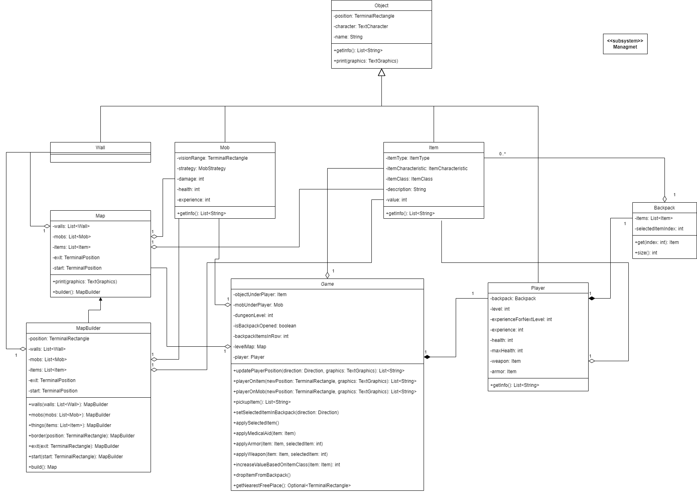
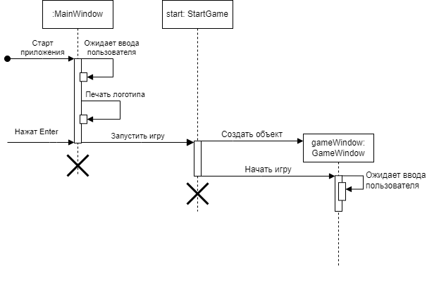
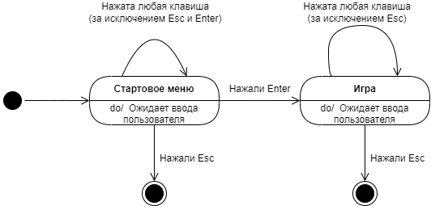
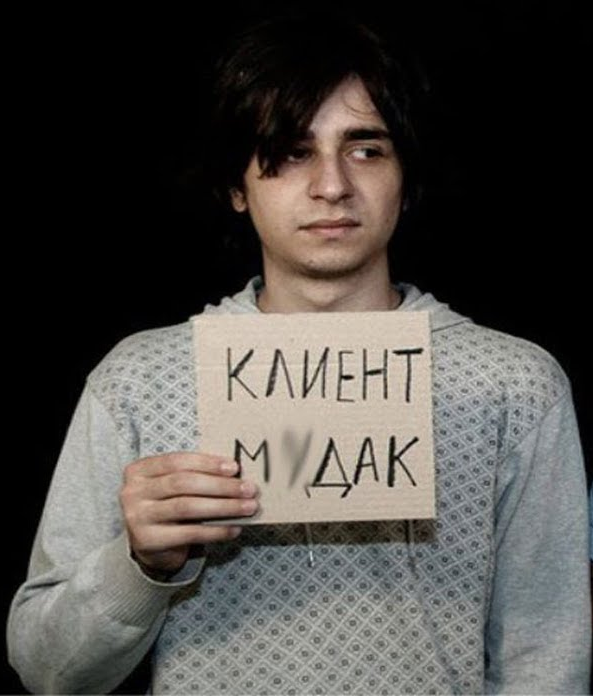
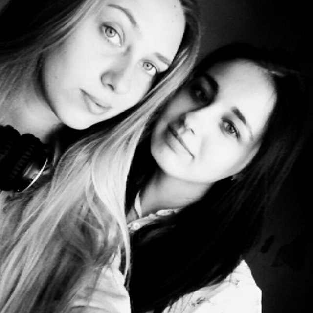

# Ultimate survival roguelike

v. 0.0.1

Авторы: Косенко Юлия, Розанова Светлана

Дата: 2023 г.

## Обзор

### Область применения

Разрабатываемая система представляет собой консольную однопользовательскую roguelike игру. Пользователь осуществляет
управление персонажем c помощью клавиатуры, вид на персонажа сверху.

### Назначение документа

Документ предназначен для описания архитектуры программного продукта. Целью документа является донесение общей концепции
разрабатываемого продукта, общее описание системы, её компонентов и их взаимодействия между собой с целью облегчения
дальнейшей разработки системы.

### Описание контекста

Система осуществляет работу в консольном окне, считываются данные с клавиатуры (во время игрового процесса) и с файлов
(дизайн уровней).

### Границы системы

- Консольная игра
- Бессюжетная игра
- Предназначена для компьютеров
- Жанр roguelike
- 2D игра 
- Вид сверху

## Architectural drivers

### Технические ограничениями

- В системе пользователя должна быть установлена Java Runtime Environment (JRE) не ниже 17 версии.

### Бизнес-ограничения

- Разработка системы должна быть закончена до 25.06.2023 г. включительно.

### Качественные характеристики системы

- Система должна быть легкосопровождаемой: актуальная документация по архитектуре разрабатываемой системе, код должен
  содержать комментарии для облегчения процесса сопровождения;
- Система должна быть легкорасширяемой: архитектура должна быть гибкой, для лёгкого внедрения новых объектов и
  функционала в систему;
- Система должна работать без видимых задержек на компьютерах средней мощности.

### Функциональные требования

- Однопользовательская игра;
- Отсутствует возможность сохранения игрового прогресса;
- Работа системы осуществляется в консольном окне;
- Управление персонажем осуществляется с помощью клавиатуры;
- Должна присутствовать возможность сгенерировать случайный уровень;
- Должна быть возможность загрузить уровень из файла;
- В игре должна быть возможность подбирать, улучшать и использовать предметы;
- В игре должна быть возможность драться с врагами (мобами).

### Нефункциональные требования

- Формат файла игрового мира должен быть человеко-читаемым для возможности загрузки своего уровня;
- Управление персонажем (ходьба) должна осуществляться с помощью стрелочек на клавиатуре;
- На экране должна отображаться информация о персонаже.

## История

Эта игра про студента, который ведёт неравную борьбу с домашками и дедлайнами и выживает благодаря энергетикам и шаурме.

Далее будет стандартное описание, где в скобках или подпунктах будут описаны тематические аналоги для конкретной игры.
Например, ``здоровье`` обозначает здоровье в стандартной игре и _ментальное здоровье_ в контексте этой.

В ходе разработки список вещей может увеличиваться.

### Описание персонажа

При запуске игры создается всегда один и тот же персонаж (студент) с базовым набором вещей на начальном уровне.

Персонаж имеет следующие характеристики:

1. **Текущий уровень**. Уровень определяет максимальное количество здоровья, которое может иметь персонаж;
2. **Текущий уровень здоровья**. Показывает, сколько в данный момент здоровья (ментального) у персонажа;
3. **Текущее значение брони**. Броню можно увеличить, надевая найденную одежду;
4. **Текущее значение урона**. Это урон, который наносит персонаж мобам в бою. Увеличить это значение можно, надевая
   найденное оружие.

Начальные значения характеристик персонажа при запуске игры:

1. Уровень: 1;
2. Здоровье: 10;
3. Броня: 0;
4. Урон: 1 (персонаж дерется голыми руками).

С каждым поднятием уровня максимальный запас здоровья увеличивается на 10% от предыдущего значения, при этом здоровье
восстанавливается до максимального при переходе на новый уровень. Также растёт количество опыта, которое надо набрать
для перехода на следующий уровень:

- На 40% от предыдущего значение для перехода на "единичный" уровень (1, 2, ..., 9, 11, 12, ...);
- На 90% от предыдущего значение для перехода на "десятый" уровень (10, 20, ...);
- На 200% от предыдущего значение для перехода на "сотый" уровень (100, 200, ...);

Для перехода на второй уровень требуется 10 очков опыта.

### Описание вещей

Вещи делятся на две категории по редкости:

1. Обычные;
2. Легендарные. Вероятность встретить легендарную вещь - 5%.

Вещи делятся на следующие категории по назначению:

1. Аптечки

Восстанавливают здоровье игрока, делятся на следующие классы:

- Маленькая аптечка (обычная вещь): восстанавливает 30% от максимального количества здоровья:
  - Просмотр фильма;
  - Кофе;
  - Перенос дедлайнов;
- Большая аптечка (легендарная вещь): восстанавливает 90% от максимального количества здоровья:
  - Дополнительные выходные;
  - Энергетик;
  - 9-ти часовой сон.

2. Броня

Защищает персонажа от урона, делится на следующие классы:

- Легкая броня (обычная вещь): увеличивает значение брони на 5:
  - Конспект;
  - Стипендия;
  - Лицензия на IDE;
- Средняя броня (обычная вещь): увеличивает значение брони на 20:
  - Запись лекций;
  - Спонсорская стипендия;
  - Ответы на летучки;
- Тяжелая броня (легендарная вещь): увеличивает значение брони на 50:
  - Автомат по предмету;
  - Работа;
  - Ответы на билеты к экзаменам.

В бою броня разрушается (устаревает), таким образом, если на персонаже надета броня, то при ударах мобов сначала будет
уменьшаться броня и только когда броня полностью разрушится - здоровье. В каждый момент времени на персонаже может быть
надета броня одного и того же класса (то есть, если надета средняя броня, то при попытке надеть лёгкую, средняя броня
будет снята и помещена в инвентарь, а на её место будет надета легкая). Можно объединять броню одного и того же класса
в одну, для этого необходимо просто надеть броню того же класса, что надета на персонажа в данный момент, тогда
характеристики брони суммируются. Это действие необратимо (нельзя разъединить броню);

3. Оружие:

Увеличивает наносимый персонажем урон, делится на следующие классы:

- Легкое одноручное (обычная вещь): увеличивает наносимый урон на 5:
  - Книга с теорией;
  - Компьютерная мышь;
  - Ручка;
- Среднее одноручное (обычная вещь): увеличивает наносимый урон на 20:
  - Сборник задач;
  - Тормозок на весь день;
  - Зарядка от ноутбука;
- Тяжелое двуручное (легендарная вещь): увеличивает наносимый урон на 50:
  - Рюкзак с тетрадями;
  - Шаурма;
  - Ноутбук.

В каждый момент времени персонаж может драться оружием одного и того же класса, при попытке вооружиться оружием другого
класса, оружие, используемое до этого, будет помещено в инвентарь, а персонаж будет вооружен выбранным оружием. Можно
объединять оружие одного и того же класса в одно, тогда характеристики оружия суммируются, для этого необходимо
вооружиться оружием того же класса, что использует персонаж в данный момент. Это действие необратимо (нельзя разъединить
оружие).

Базовый набор вещей включает в себя по одному предмету из каждого пункта выше, выбирается рандомно (с учетом
вероятности выпадения легендарной вещи).

### Описание мобов

Мобы - это враги персонажа, с которыми последний может вступать в бой.

Мобы делятся на следующие типы, различаются характеристиками и поведением:

1. Агрессивное поведение, атакуют персонажа, как только его видят, генерируются с вероятностью 34%:
   - Дедлайн;
   - Контест;
   - Сессия;
2. Пассивное поведение, просто стоят на месте, генерируются с вероятностью 33%:
   - Курсовая;
   - Диплом;
   - НИР;
3. Трусливое поведение, стараются держаться на расстоянии от персонажа, генерируются с вероятностью 33%:
   - Домашка по плюсам;
   - Стажировка;
   - Баг в коде.

За убийство каждого моба даётся опыт, изначально за агрессивных мобов 10 очков опыта, за пассивных 5 очков, за
трусливых - три. Здоровье и урон для моба генерируется случайно в диапазоне:

- Здоровье от 1 до 3;
- Урон от 1 до 2;

С ростом уровня карты растут характеристики моба:

- урон, наносимый мобом, верхняя и нижняя границы на 10%;
- здоровье моба, верхняя и нижняя границы на 15%;
- опыт, получаемый при убийстве моба, на 10%.

Каждый десятый уровень (10, 20, 30 и т.д.) мега рост характеристик мобов:

- урон, наносимый мобом, верхняя и нижняя границы на 50%;
- здоровье моба, верхняя и нижняя границы на 75%;

Все мобы на карте обозначены красным цветом и различными символами, в зависимости от типа моба.
Символы:

- Агрессивный моб: ☻;
- Трусливый моб: ☺;
- Пассивный моб: ◘.

Характеристики мобов отображаются справа от карты комнаты при вступлении с мобом в бой.

### Описание уровней

Первый уровень всегда одинаковый, чтобы пользователь смог понять базовую механику игры. Соответственно, он подгружается
из файла. При каждой загрузке категория вещей и вид мобов генерируются случайно, совпадает только их местоположения.
Все последующие уровни генерируются рандомно и записываются в файл, типы и характеристики также генерируются при
считывании в соответствии с уровнем карты.

На каждой уровне всегда ровно один вход и ровно один выход. Персонаж, после перехода на новый уровень, отображается
возле входа на уровень. Чтоб перейти на следующий уровень, персонаж должен дойти до выхода, не умерев.

Помимо этого на уровне генерируется набор вещей и определенное (в зависимости от уровня карты) количество мобов. С
каждым переходом на новый уровень (карты) генерируется больше мобов с более сильными характеристиками урона.

Алгоритм построения уровня:

1. Если уровень первый - перейти к пункту 7, иначе - к пункту 2;
2. Сгенерировать комнату (текущий уровень);
3. Сгенерировать мобов, разместить их на карте (количество передаётся генератору и зависит от уровня карты);
4. Сгенерировать предметы (аптечки, броню и оружие в следующем соотношении: 2:2:1), разместить вещи на уровне
   (количество передаётся генератору и зависит от уровня карты);
5. Сгенерировать вход и выход с уровня, нанести на карту;
6. Записать карту в файл;
7. Считать уровень из файла и сгенерировать характеристики, соответствующие уровню карты;
8. Вывести уровень на экран.

### Технические характеристики

Разрабатываемый продукт написан на Java 17 с использованием системы сборки Gradle и библиотеки Lanterna.

## Композиция

Система делится на три основные подсистемы: ``Object generation``, ``Managment``, ``UI``.

``UI`` подсистема, отвечающая за общение с пользователем, вывод на экран необходимой информации, содержит в себе
компонент _Window_. При необходимости запрашивает/отправляет информацию подсистеме ``Managment``.

``Managment`` является подсистемой, содержащей бизнес-логику. Состоит из следующих компонентов: _Game_, _Player_, _Mob_,
_Item_. _Game_ содержит основную логику системы, осуществляет управление другими компонентами. _Player_ содержит
информацию об игроке и предоставляет интерфейс для управления им. Также _Player_ осуществляет манипуляции с объектами
(_Item_). Компонент _Item_ предоставляет интерфейс для управления объектами персонажа. Компонент _Mob_ предоставляет
интерфейс для управления мобами.

Подсистема ``Object generation`` отвечает за генерацию объектов при переходе на следующий уровень, состоит из следующих
компонентов: _Map generation_ - отвечает за генерацию карты, _Item generation_ - отвечает за генерацию объектов, _Mob
generation_ - отвечает за генерацию мобов.

## Логическая структура

На рисунке выше предст валена диаграмма классов для подсистемы ``Managment``. Класс _Game_ отвечает за основную логику
работы приложения, состоит в отношении "композиция" с классом _Player_, в отношении "агрегация" с классом _Map_.

Класс _Object_ является предком классов _Player_, _Mob_, _Wall_, _Mob_, _Item_, _Map_ и содержит в себе информацию об
имени объекта, символе объекта на карте и позиции объекта.

Класс _TerminalRectangle_ - вспомогательный класс из библиотеки Lanterna, в котором информация о местоположении и
размере объекта.

Класс _TextCharacter_ - вспомогательный, хранит информацию о представлении (символе) объекта на карте.

Класс _Player_ отвечает за логику взаимодействия с персонажем, состоит в отношении "композиция" с классом _Backpack_,
через который осуществляет взаимодействие с предметами, которые находятся в рюкзаке у персонажа.

Класс _Backpack_ является хранилищем для объектов, которые собрал персонаж в процессе игры, а также хранит в себе индекс
"фокусного" объекта при взаимодействии игрока с рюкзаком.

Класс _Item_ хранит в себе информацию об игровом объекте, который пользователь может применить в соответствии с логикой
игры.

Класс _ItemCharacteristic_ - enum, который отображает, является ли объект  обычным или уникальным.

Класс _ItemType_ - enum, который отображает категорию объекта: аптечка, броня или оружие.

Класс _ItemClass_ - enum, отображающий класс объекта.

Класс _Mob_ содержит в себе информацию о мобе.

Класс _Wall_ содержит в себе информацию о стене.

Класс _MapBuilder_ осуществляет построение карты для уровня в соответствии с теми параметрами, которые ему передали.

Класс _Map_ содержит информацию о карте уровня - стенах, расположении мобов, вещей и персонажа.

## Взаимодействия и состояния

При старте приложения начинает работу объект класса MainWindow, который выводит на экран лого приложения и ожидает
реакции пользователя. Если пользователь решил начать игру, то MainWindow передаёт управление StartGame, который создаёт
необходимые объекты для игры и передаёт управление GameWindow, который отслеживает нажатия пользователя.

При входе в игру игроку отображается стартовое меню с логотипом (состояние: ``Стартовое меню``) и надписью, 
информирующей, что нужно нажать пользователю для перехода в различные состояния. В данном состоянии программа ожидает 
нажатия клавиши пользователем. Если пользователь нажал на: 

- ``Esc`` - приложение завершает свою работу;
- ``Enter`` - приложение переходит в состояние ``Игра``;
- Любая клавиша, отличная от вышеперечисленных - приложение никак не реагирует.

После перехода в состояние ``Игра`` пользователю будет отображаться уровень и вся необходимая информация. При нажатии на: 

- ``Esc`` - приложение завершит свою работу;
- Клавиши, предусмотренные в логике игры (например, стрелки для ходьбы, в ходе разработки клавиши будут добавляться, 
их описание будет находиться на экране для информирования пользователя о реакции системы на его действия) - реакция в 
соответствии с бизнес-логикой приложения.
- Любая клавиша, отличная от вышеперечисленных - приложение никак не реагирует.

### Роли и случаи использования

- Обычный пользователь:

Иванова Иванна Ивановна, 23 года. Студентка магистратуры, погребенная под кучей дедлайнов, сверху прибита сессией и
необходимостью осуществлять трудовую деятельность. В минуты прокрастинации, когда не хочет напрягать мозг, играет в
различные игры, любимый жанр - roguelike. Мышка была убита ещё в бакалавриате, поэтому осуществляет взаимодействие с
ноутбуком только с помощью клавиатуры, из-за чего отказывается играть в игры, где необходимо осуществлять какие-либо
действия с помощью мышки. Студенческая тема ей очень близка, мечтает отомстить диплому за потраченные нервы уже
несколько лет, отчего разрабатываемое приложение является очень привлекательным продуктом для неё.

Хочет поиграть в игру, при этом почувствовать себя главным героем, сражающимся со злом. Имеет слабый компьютер, поэтому 
предпочитает консольные приложения. Нравится собирать в играх различную экипировку и улучшать её. 

- Дизайнер уровней:

Коля, 30 лет. Живёт с мамой, которая не понимает значение слова "фриланс", поэтому думает, что деньги сын получает,
продавая наркотики. Николай мечтает стать геймдизайнером, но пока рисует логотипы на заказ. В качестве практики любит
придумывать карты для игр. Хотел бы поиграть в собственные разработки, но не умеет программировать. Любит играть
в roguelike и стратегии.

- Разработчики и тестировщики системы:

Студенты MSE ITMO. Устали морально и физически, поэтому хотят реализовать систему максимально быстро и качественно
(несовместимые требования), чтобы закрыть предметы без долгов и посвятить время чтению манги и просмотру аниме.
Вдохновлены возможностью написания собственной игры, поэтому в процессе разработки периодически "превращаются" в
"обычного пользователя".
