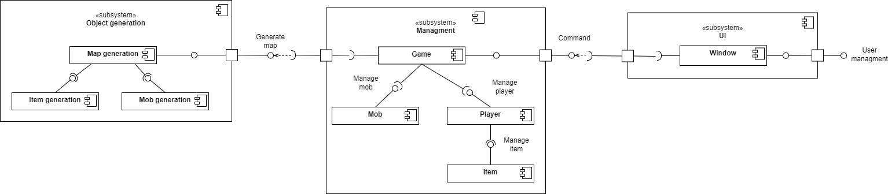

# Ultimate survival roguelike

## Обзор

### Область применения

Разрабатываемая система представляет собой консольную roguelike игру. Пользователь запускает игру в консоли, после чего
запускается первый уровень игры и персонаж игрока с базовым набором вещей. Пользователь может управлять персонажем
посредством нажатия клавиш стрелочек, переходить между уровнями с помощью дверей, а также находить и подбирать вещи в
комнатах и драться с мобами.

## История

Эта игра про студента, который ведёт неравную борьбу с домашками и дедлайнами и выживает благодаря энергетикам и шаурме.

Далее будет стандартное описание, где в скобках или подпунктах будут описаны тематические аналоги для конкретной игры.
Например, ``здоровье`` обозначает здоровье в стандартной игре и _ментальное здоровье_ в контексте этой.

В ходе разработки список вещей может увеличиваться.

### Описание персонажа

При запуске игры создается всегда один и тот же персонаж (студент) с базовым набором вещей на начальном уровне.

Персонаж имеет следующие характеристики:

1. **Текущий уровень**. Уровень определяет максимальное количество здоровья, которое может иметь персонаж;
2. **Текущий уровень здоровья**. Показывает, сколько в данный момент здоровья (ментального) у персонажа;
3. **Текущее значение брони**. Броню можно увеличить, надевая найденную одежду;
4. **Текущее значение урона**. Это урон, который наносит персонаж мобам в бою. Увеличить это значение можно, надевая
   найденное оружие.

Начальные значения характеристик персонажа при запуске игры:

1. Уровень: 1;
2. Здоровье: 10;
3. Броня: 0;
4. Урон: 1 (персонаж дерется голыми руками).

С каждым поднятием уровня максимальный запас здоровья увеличивается на 10% от предыдущего значения, при этом здоровье 
восстанавливается до максимального при переходе на новый уровень. Также растёт количество опыта, которое надо набрать 
для перехода на следующий уровень:

- На 40% от предыдущего значение для перехода на "единичный" уровень (1, 2, ..., 9, 11, 12, ...);
- На 90% от предыдущего значение для перехода на "десятый" уровень (10, 20, ...);
- На 200% от предыдущего значение для перехода на "сотый" уровень (100, 200, ...);

Для перехода на второй уровень требуется 10 очков опыта.

### Описание вещей

Вещи делятся на две категории по редкости:

1. Обычные;
2. Легендарные. Вероятность встретить легендарную вещь - 5%.

Вещи делятся на следующие категории по назначению:

1. Аптечки

Восстанавливают здоровье игрока, делятся на следующие классы:

- Маленькая аптечка (обычная вещь): восстанавливает 30% от максимального количества здоровья:
  - Просмотр фильма;
  - Кофе;
  - Перенос дедлайнов;
- Большая аптечка (легендарная вещь): восстанавливает 90% от максимального количества здоровья:
  - Дополнительные выходные;
  - Энергетик;
  - 9-ти часовой сон.

2. Броня

Защищает персонажа от урона, делится на следующие классы:

- Легкая броня (обычная вещь): увеличивает значение брони на 5:
  - Конспект;
  - Стипендия;
  - Лицензия на IDE;
- Средняя броня (обычная вещь): увеличивает значение брони на 20:
  - Запись лекций;
  - Спонсорская стипендия;
  - Ответы на летучки; 
- Тяжелая броня (легендарная вещь): увеличивает значение брони на 50:
  - Автомат по предмету;
  - Работа;
  - Ответы на билеты к экзаменам.

В бою броня разрушается (устаревает), таким образом, если на персонаже надета броня, то при ударах мобов сначала будет
уменьшаться броня и только когда броня полностью разрушится - здоровье. В каждый момент времени на персонаже может быть
надета броня одного и того же класса (то есть, если надета средняя броня, то при попытке надеть лёгкую, средняя броня 
будет снята и помещена в инвентарь, а на её место будет надета легкая). Можно объединять броню одного и того же класса 
в одну, для этого необходимо просто надеть броню того же класса, что надета на персонажа в данный момент, тогда 
характеристики брони суммируются. Это действие необратимо (нельзя разъединить броню);

3. Оружие:

Увеличивает наносимый персонажем урон, делится на следующие классы:

- Легкое одноручное (обычная вещь): увеличивает наносимый урон на 5:
  - Книга с теорией;
  - Компьютерная мышь;
  - Ручка;
- Среднее одноручное (обычная вещь): увеличивает наносимый урон на 20:
  - Сборник задач;
  - Тормозок на весь день;
  - Зарядка от ноутбука;
- Тяжелое двуручное (легендарная вещь): увеличивает наносимый урон на 50:
  - Рюкзак с тетрадями;
  - Шаурма;
  - Ноутбук.

В каждый момент времени персонаж может драться оружием одного и того же класса, при попытке вооружиться оружием другого 
класса, оружие, используемое до этого, будет помещено в инвентарь, а персонаж будет вооружен выбранным оружием. Можно 
объединять оружие одного и того же класса в одно, тогда характеристики оружия суммируются, для этого необходимо 
вооружиться оружием того же класса, что использует персонаж в данный момент. Это действие необратимо (нельзя разъединить 
оружие).

Базовый набор вещей включает в себя по одному предмету из каждого пункта выше, выбирается рандомно (с учетом
вероятности выпадения легендарной вещи).

### Описание мобов

Мобы - это враги персонажа, с которыми последний может вступать в бой.

Мобы делятся на следующие типы, различаются характеристиками и поведением:

1. Агрессивное поведение, атакуют персонажа, как только его видят, генерируются с вероятностью 34%:
   - Дедлайн;
   - Контест;
   - Сессия;
2. Пассивное поведение, просто стоят на месте, генерируются с вероятностью 33%:
   - Курсовая;
   - Диплом;
   - НИР;
3. Трусливое поведение, стараются держаться на расстоянии от персонажа, генерируются с вероятностью 33%:
   - Домашка по плюсам;
   - Стажировка;
   - Баг в коде.

За убийство каждого моба даётся опыт, изначально за агрессивных мобов 10 очков опыта, за пассивных 5 очков, за
трусливых - три. Здоровье и урон для моба генерируется случайно в диапазоне: 
- Здоровье от 1 до 3; 
- Урон от 1 до 2;

С ростом уровня карты растут характеристики моба: 
- урон, наносимый мобом, верхняя и нижняя границы на 10%;
- здоровье моба, верхняя и нижняя границы на 15%;
- опыт, получаемый при убийстве моба, на 10%.

Каждый десятый уровень (10, 20, 30 и т.д.) мега рост характеристик мобов:
- урон, наносимый мобом, верхняя и нижняя границы на 50%;
- здоровье моба, верхняя и нижняя границы на 75%;

Все мобы на карте обозначены красным цветом и различными символами, в зависимости от типа моба. 
Символы:
- Агрессивный моб: ☻;
- Трусливый моб: ☺;
- Пассивный моб: ◘.

Характеристики мобов отображаются справа от карты комнаты при вступлении с мобом в бой.

### Описание уровней

Первый уровень всегда одинаковый, чтобы пользователь смог понять базовую механику игры. Соответственно, он подгружается
из файла. При каждой загрузке категория вещей и вид мобов генерируются случайно, совпадает только их местоположения.
Все последующие уровни генерируются рандомно и записываются в файл, типы и характеристики также генерируются при
считывании в соответствии с уровнем карты.

На каждой уровне всегда ровно один вход и ровно один выход. Персонаж, после перехода на новый уровень, отображается
возле входа на уровень. Чтоб перейти на следующий уровень, персонаж должен дойти до выхода, не умерев.

Помимо этого на уровне генерируется набор вещей и определенное (в зависимости от уровня карты) количество мобов. С
каждым переходом на новый уровень (карты) генерируется больше мобов с более сильными характеристиками урона.

Алгоритм построения уровня:

1. Если уровень первый - перейти к пункту 7, иначе - к пункту 2;
2. Сгенерировать комнату (текущий уровень);
3. Сгенерировать мобов, разместить их на карте (количество передаётся генератору и зависит от уровня карты);
4. Сгенерировать предметы (аптечки, броню и оружие в следующем соотношении: 2:2:1), разместить вещи на уровне
   (количество передаётся генератору и зависит от уровня карты);
5. Сгенерировать вход и выход с уровня, нанести на карту;
6. Записать карту в файл;
7. Считать уровень из файла и сгенерировать характеристики, соответствующие уровню карты;
8. Вывести уровень на экран.

## Роли и случаи использования

Описание обычного пользователя:

1. Запустить игру в консоли;
2. Загрузиться на первый уровень игры с базовым набором вещей;
3. Перемещаться по карте с помощью клавиш клавиатуры;
4. Подобрать вещи с пола комнаты:

- надеть вещь: если на персонаже вещь того же класса, то найденная вещь и надетая объединяются в одну,
  характеристики обновляются. Если вещи разного класса, то вещь на персонаже складывается в инвентарь, а найденная вещь
  надевается на персонажа;
- сложить в инвентарь: вещь добавляется в инвентарь;
- оставить на полу;

5. Открыть инвентарь, выбрать вещь из инвентаря:

- выбросить вещь: вещь отображается на полу, в инвентаре ее больше нет. Персонаж может подобрать вещь снова;
- надеть на себя: если на персонаже вещь того же класса, то вещь из инвентаря и надетая объединяются в одну,
  характеристики обновляются. Если вещи разного класса, то вещь на персонаже складывается в инвентарь, а найденная вещь
  надевается на персонажа;

6. Вступить в бой с мобами:

- первый удар всегда принадлежит мобу. Если в результате удара персонаж не умер, то он бьет следующим и т.д. пока не
  умрет или моб, или персонаж.

7. Если в результате боя уровень здоровья упал до 0, получить сообщение о проигрыше и завершить сессию игры.
8. Иначе - перейти на следующий уровень;
9. Выйти из игры.

## Технические характеристики

Разрабатываемый продукт написан на Java 17 с использованием системы сборки Gradle и библиотеки Lanterna.

## Композиция

Диаграмма компонентов

Компонент ``UI`` отвечает за вывод в консоль и взаимодействие с ней, компонент ``Managment`` отвечает за логику и
управление различных объектов игры. Отдельными компонентами выделены ``Character`` - персонаж, ``Map`` - карта,
``Mob`` - мобы и ``Objects`` - различные объекты на карте, например, аптечка или броня.

Компонент ``Object generation`` отвечает за генерацию различных объектов, необходимых для уровня.

## Логическая структура

Диаграмма классов персонажа и вещей

Персонаж имеет информацию о своём местоположении, уровне, надетых и собранных вещах. Интерфейс ``Item`` представляет
собой интерфейс вещей, что позволяет улучшить расширяемость в будущем, ``type`` - тип вещи: обычная или легендарная,
``amount`` - это специализированное количество. Для аптечек это количество восстанавливаемого здоровья, для оружия -
количество наносимого урона, и т.д. ``Backpack`` - это рюкзак с вещами, которые собрал персонаж.

Диаграмма классов мобов с генерацией

Каждый моб содержит информацию о своём типе, и, как следствие, соответствующее поведение, количестве здоровья и
наносимом уроне. Классы генерации отвечают за генерацию и запись в файл соответствующего объекта.

## Взаимодействия и состояния

Генерация уровня

Для каждого уровня будет генерироваться определенное количество комнат, для каждой комнаты будут генерироваться предметы
и мобы, которые будут размещаться внутри, затем будет генерироваться путь между комнатами. Гарантируется, что есть
хотя бы один путь от начальной комнаты (старт уровня) до конечной (переход на следующий уровень).
